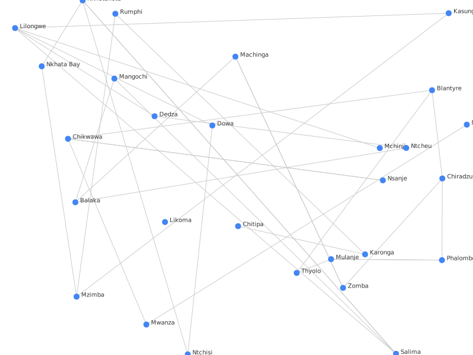

# GHII Technical Challege

## Installation

```bash
# Clone the repo
git clone https://github.com/PreciousNyasulu/GHII_Technical_Challege.git
cd GHII_Technical_Challege

# Install dependencies
npm install
````

## Dependencies

```json
"@types/d3": "^7.4.3",
"@types/d3-force": "^3.0.10",
"@types/node": "^24.0.13",
"tsx": "^4.20.3"
```

---

## Build & Run

### Compile TypeScript

```bash
npx tsc
```

### Run the Program

```bash
npx tsx dist/main.js
```

---

## Input Data

* [Nodes.json](./_data/nodes.json_): Initial node positions (from the provided data).
* [Edges.json](./_data/edges.json)

### Graph Layout Algorithm Output


